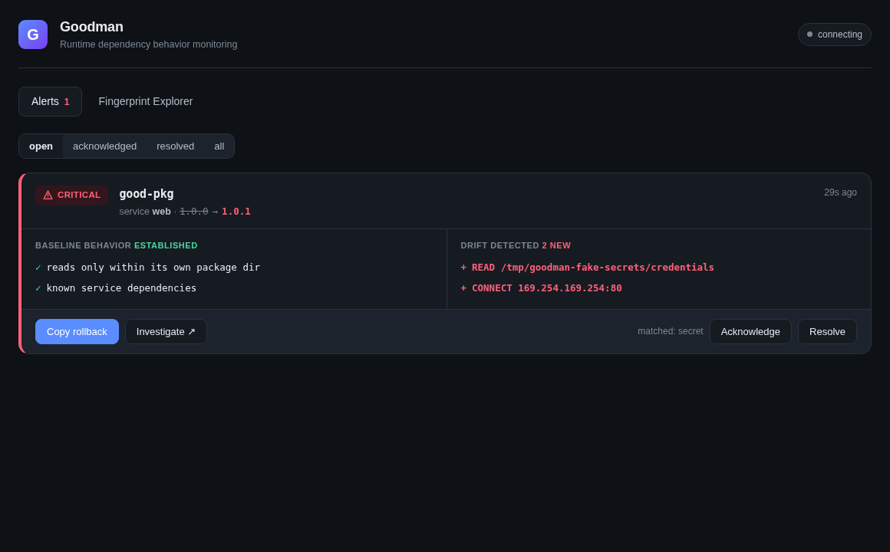

# Goodman

[](https://github.com/hi-heisenbug/goodman/actions/workflows/ci.yml)
[](LICENSE)
[](go.mod)
[](deploy/helm/goodman)

Goodman is a runtime dependency-security sensor. It attributes security-relevant
Linux syscalls to the exact npm package that caused them, learns a behavioral
baseline per `(service, package, version)`, and raises an alert when a dependency
version starts doing something new.

The short version: the kernel can tell you a process opened a file or connected
to an IP. Goodman tells you which dependency in that process did it.



The embedded Goodman dashboard by Heisenbug is a production React/Vite UI with
live alert review, fingerprint exploration, SSE updates, and responsive mobile
layouts.

## Demo

Watch the 54-second product walkthrough:

<video src="demo_build/goodman_demo.mp4" controls width="100%" title="Goodman product demo"></video>

[Open the demo video](demo_build/goodman_demo.mp4)

## What It Detects

Goodman is built for dependency behavior drift:

- a package version that starts reading secrets, tokens, SSH keys, `.npmrc`, or
  cloud credentials
- a dependency that starts connecting to cloud metadata or a new outbound host
- a package update that adds process execution where the baseline had none
- any new canonical behavior compared to the learned baseline for that package

It is detection-first in v1. Goodman observes, attributes, fingerprints, and
alerts; it does not block or sandbox.

## How It Works

```text
kernel tracepoints
open/openat/openat2/connect/execve
        |
        v
eBPF sensor captures syscall + user stack
        |
        v
userspace attribution maps stack frame -> package@version
        |
        v
collector learns fingerprints and diffs new behavior
        |
        v
REST API, SSE stream, Prometheus metrics, dashboard
```

1. **Capture:** CO-RE eBPF hooks `open`, `openat`, `openat2`, `connect`, and `execve` for watched
   Node/Python processes and records the user-space stack.
2. **Attribute:** userspace resolves stack addresses through V8 perf maps and
   `/proc/<pid>/maps`, then maps the deepest `node_modules/<pkg>/` frame to its
   `package.json` version.
3. **Fingerprint:** events are canonicalized into stable behaviors such as
   `READ /app/node_modules/pkg/**` and `CONNECT 169.254.169.254:80`.
4. **Diff:** the collector compares live behavior to the learned baseline and
   applies configurable high-risk rules.

Goodman prefers `<unknown>` over a guessed package name. Incorrect attribution is
worse than no attribution.

## Quick Start

You need an x86-64 Linux host with kernel 5.8+ and BTF, plus Go, clang/LLVM,
bpftool, and Node if you want to rebuild the dashboard.

The complete setup and usage guide is in
[docs/setup-and-usage.md](docs/setup-and-usage.md). The shortest local path is:

```bash
make doctor
make build
make test
make smoke
```

`make smoke` is the no-root demo. It starts the collector, feeds synthetic
baseline and drift events, and asserts exactly one CRITICAL alert.

To see Goodman catch real npm supply-chain attacks (event-stream, eslint-scope,
ua-parser-js, node-ipc) reproduced as benign fixtures:

```bash
make replay
```

Each scenario learns a baseline, replays the attack's runtime behavior, and
asserts the expected CRITICAL alert. See
[docs/replay-corpus.md](docs/replay-corpus.md).

To explore the product UI with realistic data:

```bash
make demo
```

Then open `http://127.0.0.1:8844`. This no-root path starts the collector with a
local SQLite database, seeds baseline fingerprints and dependency-drift alerts,
and keeps the dashboard running until you press `Ctrl-C`.

For the real eBPF path:

```bash
sudo make e2e
```

That runs a benign drift replay against the included Node workload:
`good-pkg@1.0.0` is learned as the baseline, then `good-pkg@1.0.1` reads a fake
credentials file and connects to a localhost sink. The expected result is one
CRITICAL alert for the new behavior.

## Local Dashboard

```bash
GOODMAN_DSN=goodman.db GOODMAN_LEARN_OBS=50 GOODMAN_LEARN_MIN_AGE=1s \
  ./bin/collector -listen :8844
```

Open `http://localhost:8844`. The dashboard is embedded in the collector binary,
so a fresh Go build can serve the UI without a separate Node server.

## Kubernetes

```bash
scripts/install-k8s.sh --cluster prod
```

Enable package attribution on the Node workloads you want Goodman to watch:

```bash
scripts/enable-node-attribution.sh --namespace checkout --selector app=api
```

Or patch every Deployment in a namespace:

```bash
scripts/enable-node-attribution.sh --namespace checkout --all
```

Open the dashboard:

```bash
kubectl -n goodman-system port-forward svc/goodman-collector 8844:8844
```

Tier-1 Node attribution is one environment variable on watched workloads:

```yaml
env:
  - name: NODE_OPTIONS
    value: "--perf-basic-prof --interpreted-frames-native-stack"
```

See [docs/deployment.md](docs/deployment.md) for production details, Postgres
configuration, image publishing, and the chart resources.

## Repository Map

| Path | Purpose |
|---|---|
| `bpf/` | eBPF C program, shared wire struct, generated `vmlinux.h` |
| `cmd/sensor` | privileged sensor: loads eBPF, attributes events, posts batches |
| `cmd/collector` | ingestion, fingerprinting, diffing, API, dashboard |
| `cmd/goodmanctl` | CLI for tailing events, alerts, ack/resolve, fingerprints |
| `internal/attribute` | stack-to-package attribution |
| `internal/fingerprint` | behavior aggregation and baseline promotion |
| `internal/diff` | baseline comparison and high-risk rule evaluation |
| `dashboard/` | React/Vite dashboard source |
| `deploy/` | Dockerfiles, Helm chart, example rules |
| `test/` | synthetic smoke driver, workload fixtures, e2e harness |

## Documentation

- [Getting started](docs/getting-started.md)
- [Setup and usage](docs/setup-and-usage.md)
- [Architecture](docs/architecture.md)
- [Attribution](docs/attribution.md)
- [Configuration](docs/configuration.md)
- [Deployment](docs/deployment.md)
- [API reference](docs/api.md)
- [Development](docs/development.md)
- [Troubleshooting](docs/troubleshooting.md)
- [Agent instructions](AGENTS.md)

## Development

```bash
make doctor
make build
make vet
make test
make smoke
```

Use [docs/setup-and-usage.md](docs/setup-and-usage.md) for the full local,
dashboard, CLI, and Kubernetes workflow.

Run `sudo make e2e` before merging changes to `bpf/`, `internal/loader/`, or
`internal/attribute/`.

The highest-severity invariant is the shared event layout:
`bpf/goodman.h` `struct event` and `internal/model/types.go` `RawEvent` must stay
byte-for-byte identical. `internal/model/types_test.go` enforces this.

## Status

Goodman v0.1.0 includes:

- eBPF capture for file open, network connect, and process exec
- Tier-1 npm attribution through V8 perf maps
- SQLite and Postgres storage
- baseline learning and behavior drift detection
- configurable high-risk rules
- REST API, SSE stream, Prometheus metrics, and embedded dashboard
- Docker images and Helm chart

Fast-follow items are documented in [plan.md](plan.md): mutating-webhook
auto-injection, Python/PyPI attribution, and Tier-2 native V8 unwinding.

## License

Apache-2.0. See [LICENSE](LICENSE).
